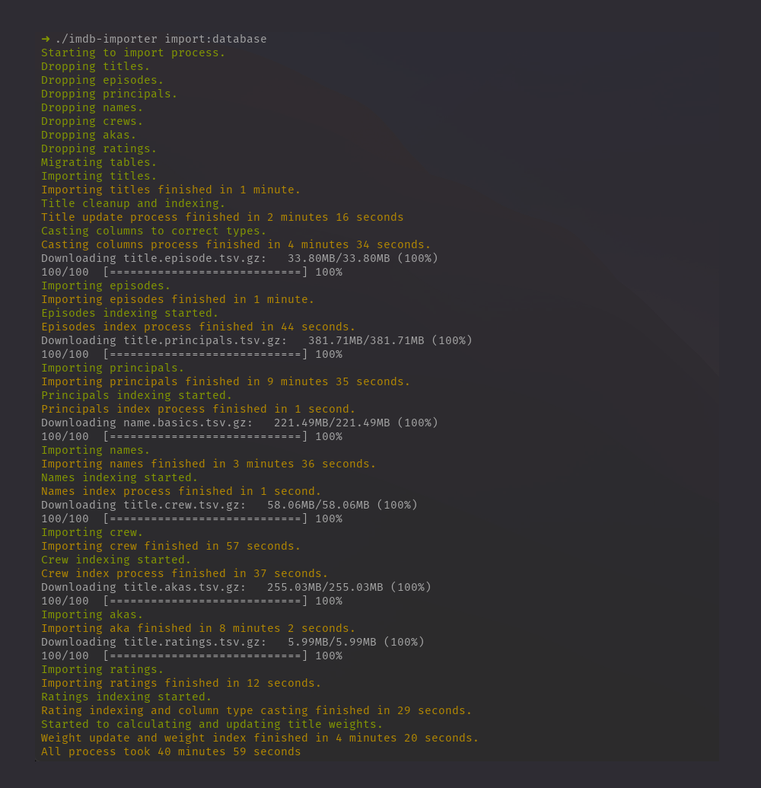

# Imdb Importer

This project import imdb datasets to a postgresql database. After import process indexed and optimized database can [be used](/docs/schema.md).

Importer has own downloader and downloads all datasets and uses this files. Most of the import process done by built in postgresql import function called [COPY](https://www.postgresql.org/docs/9.2/sql-copy.html) which is fairly fast process. Most time-consuming steps are indexing and optimizing tables.

## Database structure

We have an initial database structure (you can find in database/migrations folder) to import all data to postgresql properly. After importing process tables altered and indexed properly which you can find final schema [here](/docs/schema.md).

## Installing & Importing

imdb-importer requires php or docker on your system. You can find docker usage after this section.

In this section I assume you have php installed your system. Next section I will cover docker usage.

Go to releases and download [imdb-importer](https://github.com/hakanersu/imdb-importer/releases/download/0.2.0/imdb-importer) and put it desired location in your computer. Create `.env` file in same folder which you can find an example file in this repository.  [.env.example](https://github.com/hakanersu/imdb-importer/blob/master/.env.example)

After changing database credentials you can use `php imdb-importer import:database` command to import all datasets, or you can selectively import datasets;

```bash
php imdb-importer import:database --only=title,episodes
```

Or you can skip particular dataset;

```bash
php imdb-importer import:database --skip=principal
```

Available dataset aliases are `title, episode, principal, name, crew, aka, rating`

Import command drops all tables and starts over when started but if you already downloaded datasets it won't download datasets again. If you need to update this files you need to delete this files which all stored in `/storage/tmp/` folder.

As I mentioned before indexing and altering tables can be take time. Over all downloading and importing process take around `45min` on a decent computer. If you don't really need to principal, name, crew or aka tables you can skip this tables. But for basic movie and tv series information title, episode and rating are the most important tables and this tables import process takes around `10min`.

## Using with docker

First of instead of downloading in releases page just clone the project. Then run command below to build image.

```bash
docker build . --target imdb_importer -t imdb_importer
```

After build we have a helper file to use called `importer`. Basically you can run same commands as above with this command.

```bash
bash importer import:database
```

## Searching

Basic postgresql search will be slow, you can add full text search to titles datatable with `php imdb-importer import:fulltext`. This will run below queries to add fairly fast search feature.

```sql
ALTER TABLE titles ADD COLUMN tsv_title_text tsvector;
```


```sql
CREATE INDEX tsv_title_text_idx ON titles USING gin(tsv_title_text);
```

```sql
UPDATE titles SET tsv_title_text = setweight(to_tsvector(coalesce(primary_title,'')), 'A') || setweight(to_tsvector(coalesce(original_title,'')), 'B');
```

## Screenshots



If you interested I'm using this importer in opensource [watched movie tracker](https://github.com/hakanersu/iwatched).
